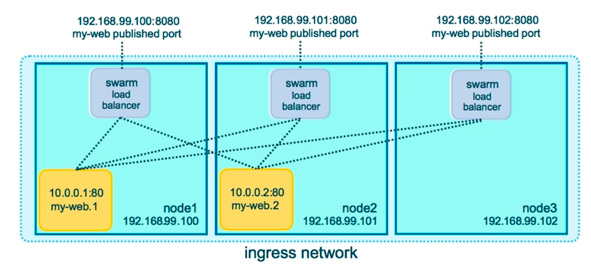
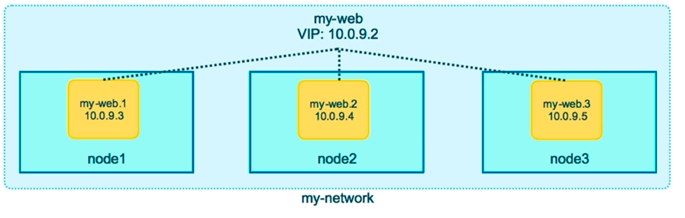

# Docker Swarm

__Routing Mesh:__  
Routing Mesh is a built-in cluster-wide load balancing System.
lets say you have three nodes:
1. node-1
2. node-2 # only one replica of a service
3. node-3  

Ingress Network:
When you create a service in Docker Swarm and publish a port (for example using -p 8080:80), Swarm automatically attaches the service to the ingress overlay network and activates the routing mesh. Step by step: first, a client sends a request to any node’s IP address on the published port (for example, node1:8080). Second, the node that receives the request does not check whether the container is running locally; instead, its internal swarm load balancer forwards the request into the ingress network. Third, the routing mesh selects one of the available service replicas running anywhere in the cluster (for example on node2). Fourth, the request is tunneled over the overlay network to that container (for example 10.0.0.x:80). Finally, the container processes the request and the response is sent back to the client through the same routing path. This is why, in Swarm mode, you can access a service from any node in the cluster even if the container is running on a different node.
step by step:
1. node3 will receive the requests
2. Send the request to ingress network
3. load balancer will select a replica
4. container will receive the request and after process it will send back the response in that path. 
Ingress Network -> Handle the published port
Routing Mesh -> from any node service access possible
Overlay IP --> for Container internal Communication
[For more details](https://chatgpt.com/c/69a25f86-aea0-8320-b6ac-80695a6f5b58)

summary:
```sh
node3 → ingress network → node1 বা node2
```


```sh
docker service create -p 80:80 nginx
```
Routing mesh does:
1. Routes ingress (incoming) packets for a service to proper task
2. Spans all nodes in Swapn
3. Uses IPVS from Linux Kernel
4. Load balances Swarm Services across their Tasks

you can access this using any of the service name. 
Because of Routing mesh.
the way it works:
``` node-1 → swarm ingress network → node-2 → drupal container ```
It describes that, from any container you can access the resource through the published port.

__Overlay Network:__  
It is a special network driver. This network connects among the 
container as if they are on the same LAN network.

